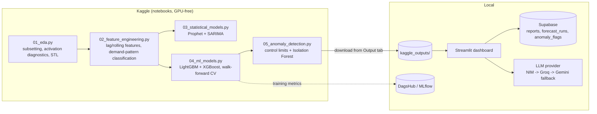

# RetailCast: Forecasting and Anomaly Insights

Retail demand forecasting, anomaly detection, and a self-verifying GenAI narrative layer,
built on the [Favorita Store Sales](https://www.kaggle.com/competitions/store-sales-time-series-forecasting)
dataset. 10 stores x 6 product families, 60 series, benchmarked across Prophet, SARIMA,
LightGBM, and XGBoost with expanding-window walk-forward cross-validation.

The project is split into two stages: heavy compute (EDA, feature engineering, model
training, anomaly detection) runs on Kaggle notebooks; a lightweight Streamlit dashboard
runs locally against the downloaded results, with an LLM layer that generates a narrative
report and checks its own numeric claims against the source data before showing it to you.
Every generated report is saved to Supabase automatically and can also be downloaded
directly from the dashboard as a Markdown file, both for the report you just generated and
for any past report in history.

## Architecture



## Results at a glance

**Forecasting (holdout, most recent 15 days):**

| Model | MASE | MAPE | WAPE |
|---|---|---|---|
| **XGBoost** (best) | **0.632** | 15.23% | 11.76% |
| LightGBM | 0.674 | 15.32% | 12.55% |
| SARIMA (3-series avg) | 1.019 | 15.72% | 17.60% |
| Prophet (60-series avg) | 1.001 | 18.18% | 18.34% |

A single global tree model pooling across all 60 series beats per-series statistical
models on average error — at the cost of losing series-specific interpretability. Prophet
and SARIMA both land near or above MASE 1.0, meaning on average they're roughly on par
with or worse than a naive lag-7 seasonal baseline on this holdout window.

**Anomaly detection (synthetic-injection evaluation):**

| Method | Precision | Recall | F1 |
|---|---|---|---|
| Control limits (k=2.5) | 0.581 | **0.86** | **0.694** |
| Isolation Forest (5% contamination) | **0.667** | 0.60 | 0.632 |

Control limits catch more true anomalies (higher recall) at the cost of more false
positives. Isolation Forest is stricter and misses more. Isolation Forest's recall is
structurally capped by its fixed contamination rate, independent of the true anomaly rate.

**Illustrative cost-of-error framing (holdout, USD):** XGBoost ~$193,153 vs. LightGBM
~$206,145 in estimated cost of forecast error, using published grocery-retail margin
benchmarks — not verified P&L data (see Limitations).

## Tech stack

- **Modeling:** Prophet, statsmodels (SARIMAX), LightGBM, XGBoost, scikit-learn (IsolationForest)
- **Experiment tracking:** MLflow via DagsHub
- **Dashboard:** Streamlit
- **Storage:** Supabase (Postgres)
- **LLM narrative:** NVIDIA NIM / Groq / Google Gemini, with automatic fallback

## Project structure

```
retailcast/
│
├── kaggle/                               # Everything that runs on Kaggle, not locally
│   ├── KAGGLE_SETUP.md                   # env setup, secrets, run order
│   ├── requirements-ml.txt               # single source of truth — installed via !pip install on Kaggle
│   └── notebooks/
│       ├── 01_eda.ipynb                  # subsetting, activation diagnostics, STL, stationarity tests
│       ├── 02_feature_engineering.ipynb  # lag/rolling/calendar features, demand-pattern classification
│       ├── 03_statistical_models.ipynb   # Prophet (60 series) + SARIMA deep-dive (3 series)
│       ├── 04_ml_models.ipynb            # global LightGBM + XGBoost, walk-forward CV, MLflow/DagsHub
│       └── 05_anomaly_detection.ipynb    # control limits + Isolation Forest, synthetic-anomaly eval
│
├── kaggle_outputs/                       # Downloaded from Kaggle's Output tab after each run
│
├── src/                                  # LOCAL-ONLY modules — imported by the dashboard
│   ├── llm/
│   │   ├── narrative.py                  # prompt construction + provider routing (NIM -> Groq -> Gemini)
│   │   └── grounding_check.py            # regex-extract numeric claims, verify against source facts
│   ├── storage/
│   │   └── supabase_client.py            # save/fetch forecast runs, reports, anomaly flags
│   ├── tracking/
│   │   └── mlflow_utils.py               # (optional) query past DagsHub/MLflow runs for the dashboard
│   └── utils/
│       ├── config.py                     # loads configs/config.yaml, env vars
│       └── metrics.py                    # MAPE/WAPE/MASE - single source, used by dashboard + tests
│
├── dashboard/
│   ├── app.py                            # st.navigation router: page titles/icons/order, page_config
│   └── views/
│       ├── home.py                       # landing page, nav cards to each view
│       ├── overview.py                   # dataset scope, demand pattern classification, stationarity
│       ├── forecast_explorer.py          # model comparison, per store/family forecast vs actual
│       ├── anomaly_view.py               # flagged anomalies, control-limit vs IsoForest comparison
│       └── ai_report.py                  # GenAI narrative, key-metric charts, grounding-check status
│
├── .streamlit/
│   └── config.toml                       # theme: dark base, custom accent/sidebar colors
│
├── configs/
│   └── config.yaml                       # selected stores/families, horizon, CV folds, cost-per-unit, thresholds
│
├── tests/
│   ├── test_metrics.py                   # unit tests for MAPE/WAPE/MASE functions
│   └── test_grounding_check.py           # unit tests for numeric-claim verification logic
│
├── .env.example                          # NIM/Groq/Gemini API keys, Supabase URL + key, DagsHub token + URL
├── .gitignore
├── requirements-local.txt                # Streamlit, Supabase, LLM clients, pyyaml, python-dotenv
└── README.md                             # architecture diagram, setup instructions, results summary
```

## Setup

### 1. Kaggle phase

Run `kaggle/notebooks/01_eda.py` through `05_anomaly_detection.py` in order on Kaggle,
attaching each notebook's output as the input source for the next (see
`kaggle/KAGGLE_SETUP.md`). Download all 13 output files from each notebook's Output tab
into a local `kaggle_outputs/` folder at the repo root.

### 2. Local dependencies

```bash
pip install -r requirements-local.txt
pip install pytest
```

### 3. Environment variables

```bash
cp .env.example .env
```

Fill in at least one LLM provider key (`NIM_API_KEY` / `GROQ_API_KEY` / `GEMINI_API_KEY`)
and your Supabase **secret** key (this runs server-side, not in a browser).

### 4. Supabase tables

Run in the Supabase SQL editor:

```sql
create table reports (
  id uuid primary key default gen_random_uuid(),
  created_at timestamptz default now(),
  report_text text not null,
  facts jsonb not null,
  provider text not null,
  grounding_ratio float8 not null
);

create table forecast_runs (
  id uuid primary key default gen_random_uuid(),
  created_at timestamptz default now(),
  model text not null,
  fold text not null,
  mape float8,
  wape float8,
  mase float8
);

create table anomaly_flags (
  id uuid primary key default gen_random_uuid(),
  created_at timestamptz default now(),
  date date not null,
  store_nbr int not null,
  family text not null,
  sales float8,
  forecast float8,
  residual float8,
  control_limit_flag int,
  isoforest_flag int
);
```

### 5. Verify and run

```bash
pytest tests/ -v
streamlit run dashboard/app.py
```

## Limitations

- **Backtesting, not live forecasting.** Every model is evaluated on a 15-day holdout
  window that already has known actuals. There's no production path that generates
  predictions for genuinely unseen future dates — that would need retraining on the full
  history and recursive multi-step forecasting (lag features depend on actual past sales,
  which don't exist yet for real future dates). This was a deliberate scope boundary, not
  an oversight.
- **`is_holiday` is national-only.** Regional/local holidays tied to a specific store's
  city aren't captured.
- **Cost-per-unit figures are illustrative**, grounded in published grocery-retail margin
  benchmarks, not this business's actual P&L.
- **The grounding check is regex-based**, not full claim verification. It can miss
  paraphrased claims with no literal number, and can flag numbers that are correct but
  simply aren't in the source facts.

## Testing

```bash
pytest tests/ -v
```

Covers `MAPE`/`WAPE`/`MASE` correctness (`tests/test_metrics.py`) and the numeric claim
extraction/tolerance logic behind the grounding check (`tests/test_grounding_check.py`).